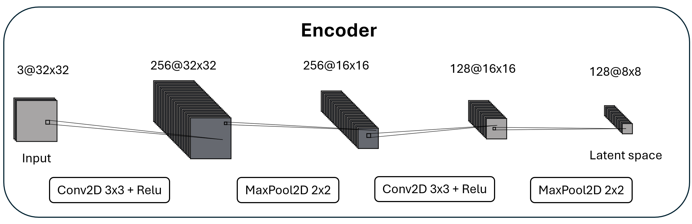
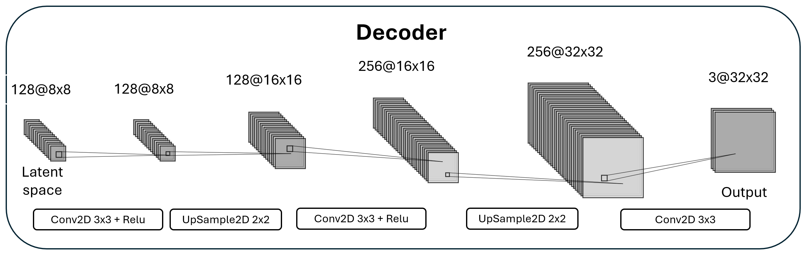
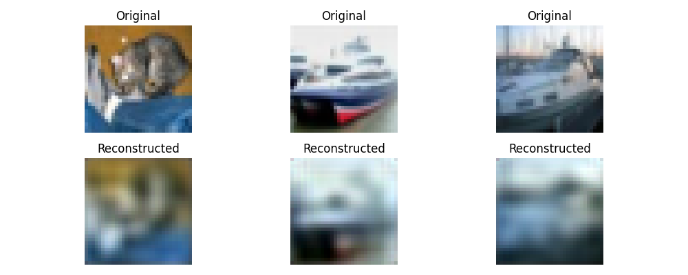
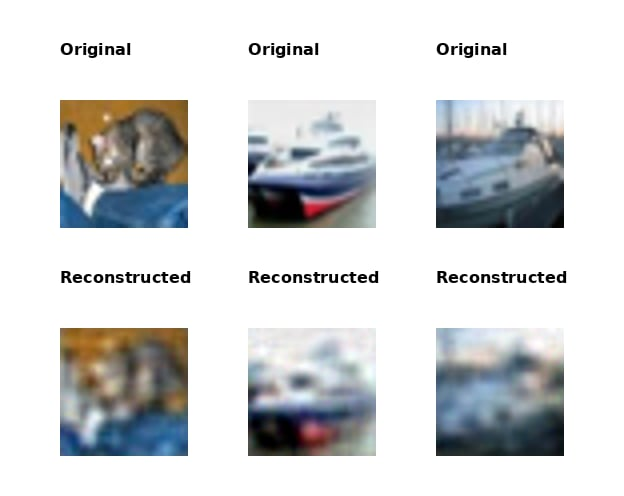
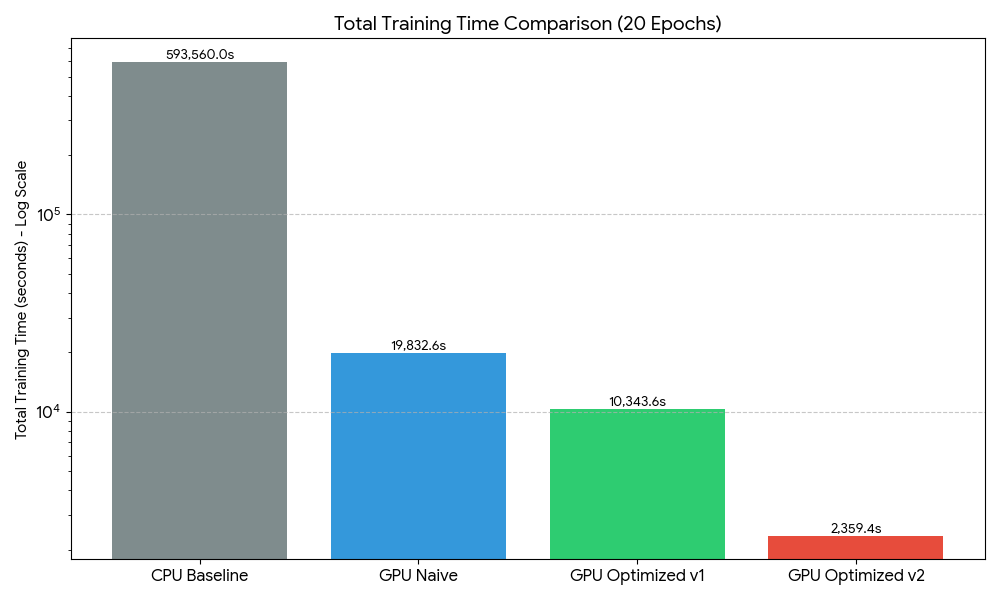
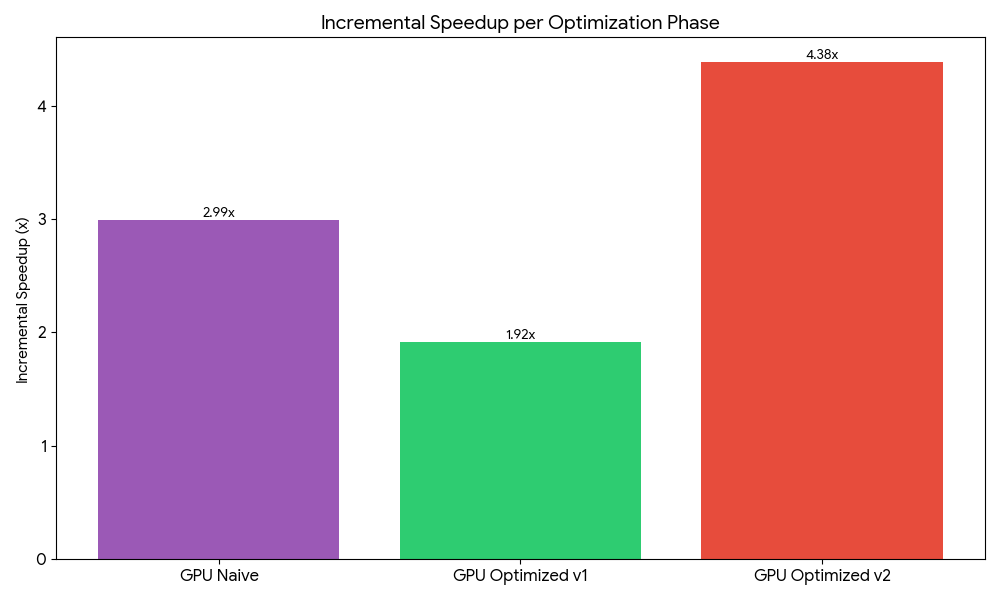

Team 4 \
22127242 Nguyen Long \
22127309 Nguyen Minh Nhat

## Section 1: Problem Description

### 1. Problem Statement
This project builds an autoencoder for image reconstruction on the CIFAR-10 dataset.  
An autoencoder learns to compress images and then reconstruct them back.  
The main goal is to implement and speed up this process using CUDA on GPU, because CPU training is very slow for neural networks.

### 2. CIFAR-10 Dataset Overview
CIFAR-10 is a popular image dataset for computer vision tasks.

- Total images: 60,000  
- Image size: 32 × 32 pixels  
- Color channels: 3 (RGB)  
- Classes (10): airplane, automobile, bird, cat, deer, dog, frog, horse, ship, truck  
- Training set: 50,000 images  
- Test set: 10,000 images  

Each image is stored as unsigned 8-bit values.

**Data preprocessing**:
- Pixel values are normalized from \[0, 255\] to \[0, 1\] by dividing by 255.
- Labels are ignored during autoencoder training.
- No data augmentation is applied.

(Sample images from each class will be shown here.)

### 3. Autoencoder Architecture
The autoencoder has two main parts: an encoder and a decoder.  
The encoder compresses the image into a smaller representation.  
The decoder reconstructs the image from that representation.

**Input size**: 32 × 32 × 3  
**Latent size**: 8 × 8 × 128 = 8,192 features  
**Output size**: 32 × 32 × 3  

#### Encoder
- Conv2D: 3 → 256 channels, kernel 3×3, padding 1  
- ReLU  
- MaxPool2D: 2×2 → output 16×16×256  
- Conv2D: 256 → 128 channels, kernel 3×3, padding 1  
- ReLU  
- MaxPool2D: 2×2 → output 8×8×128  


#### Decoder
- Conv2D: 128 → 128 channels, kernel 3×3, padding 1  
- ReLU  
- UpSample2D: 2×2 → output 16×16×128  
- Conv2D: 128 → 256 channels, kernel 3×3, padding 1  
- ReLU  
- UpSample2D: 2×2 → output 32×32×256  
- Conv2D: 256 → 3 channels, kernel 3×3, padding 1  
- No activation function in the last layer  

The decoder mirrors the encoder structure to help image reconstruction.



### 4. Project Objectives
- **Performance**: Achieve large speedup using GPU compared to CPU (target >20×).  
- **Learning**: Understand autoencoders, CUDA programming, and GPU optimization.  
- **Quality**: Reconstruct CIFAR-10 images with low reconstruction loss.  
- **Pipeline**: Use the trained encoder to extract features for later classification.


## Section 2: Implementation Phases

### Phase 2.1: CPU Baseline Implementation

#### Objectives
- Build a correct autoencoder running on CPU.
- Verify forward and backward passes work as expected.
- Measure time and loss as a baseline before GPU optimization.
- This phase is required to ensure correctness before moving to CUDA.

#### Implementation Details

##### Data Pipeline
- Load CIFAR-10 data from binary files.
- Each image consists of 1 label byte and 3072 image bytes (32×32×3).
- Normalize pixel values from [0, 255] to [0, 1].
- **Training uses only 1,000 images (~2% of CIFAR-10 training set)** to speed up CPU experiments.
- **Testing uses the full 10,000-image test set**.

##### Layer Implementations
- **Conv2D**: 3×3 convolution with padding, implemented using nested CPU loops.
- **ReLU**: Element-wise max(0, x).
- **MaxPool2D**: 2×2 pooling with stride 2, take maximum value.
- **UpSample2D**: Nearest-neighbor upsampling by factor 2.

- **Forward pass**:  
  Each layer first calls the `forward()` function of its previous layer.  
  After the previous output is ready, the current layer computes its own output.

- **Backward pass**:  
  The execution order is reversed.
  Each layer computes its gradients and the input gradient based on the output gradient, then calls `backward()` of the previous layer, passing to it the input gradient.

This design keeps the layer connections simple and makes debugging easier.

##### Training Loop
- Loop over epochs.
- Shuffle the 1,000 training images each epoch.
- For each image:
  - Forward pass through encoder and decoder.
  - Compute MSE loss.
  - Backward pass.
  - Update weights using SGD.
- Save model parameters after each epoch.

##### Key Code Snippets

Convolution function signature:
```
void convolve_cpu(
    float *dst,
    const float *src,
    const float *kernel,
    int col,
    int row,
    int kernel_width
);
```

Main training loop:
```
for (const auto& image : image_refs) {
    input->setImage(image->data);
    output->forward();
    output->backward(learning_rate, nullptr);
}
```

#### Results

- **Training data**: 1,000 images (≈2% of CIFAR-10 training set).
- **Test data**: Full 10,000-image CIFAR-10 test set.
- **Reconstruction loss**:
  - Training MSE loss ≈ **0.01**.
  - Test MSE loss ≈ **0.01**.
- This result is **surprising**, because the model was trained on a very small subset but still shows similar loss on the full test set.
- Loss values are stable during evaluation.
- Reconstructed images preserve overall structure but are blurry.
- **Performance (CPU, 2% dataset only)**:
  - Average epoch time: **59.35 seconds**
  - Total training time: **11,869.94 seconds**
- Total parameters: ~751,875, small enough for CPU memory.


#### Key Takeaways
- Even training on only 1,000 images, the autoencoder generalizes well in terms of MSE.
- CPU performance is very slow, mainly due to convolution.
- Conv2D is the main bottleneck.
- These observations strongly motivate moving convolution and training to GPU.

## Phase 2.2: GPU Basic Implementation

### Objectives
The objective of this phase was to port the complete CPU-based autoencoder to CUDA and execute it on the GPU using **basic parallelization techniques**. All major operations—convolution, activation, pooling, upsampling, and loss computation—were reimplemented as CUDA kernels.  

Key goals included:
* Verifying correctness by comparing GPU outputs against the CPU baseline (ensuring MSE $\approx 0.01$).
* Establishing an **initial GPU performance baseline** to measure the impact of later optimizations.

---

### Implementation Details

#### Parallelization Strategy
A **1:1 mapping strategy** was adopted for all naive kernels to prioritize implementation correctness. Each CUDA thread is responsible for computing a single output element:
* **Convolution/Upsampling:** One thread per output pixel.
* **Max Pooling:** One thread per pooled output element.
* **ReLU:** One thread per activation element.

---

#### Kernel Designs

**Convolution (Conv2D)** As seen in the provided `conv2d.cu`, each thread computes one output pixel $(x, y, f)$. The thread performs nested loops over input channels and the kernel window:
* **Global Memory usage:** Every weight and input pixel is fetched directly from global memory within the inner loops.
* **Boundary Handling:** Explicit padding checks ensure threads do not access out-of-bounds memory.

```cpp
__global__ void naive_conv_forward_kernel(
    float* output, const float* input, const float* weights, 
    const float* biases, int width, int height, 
    int in_channels, int out_channels, int kernel_size) {
    
    const int x = blockIdx.x * blockDim.x + threadIdx.x;
    const int y = blockIdx.y * blockDim.y + threadIdx.y;
    const int f = blockIdx.z;

    if (x < width && y < height && f < out_channels) {
        // Nested loops over channels and kernel size...
    }
}
```

---

**Other Kernels**
* **MaxPool2D:** Threads scan a $2 \times 2$ window to find the maximum value.
* **ReLU:** In-place element-wise operation: $x = \max(0, x)$.
* **Upsampling:** Nearest-neighbor mapping using integer coordinate scaling.

---

#### Memory Management
All model parameters and activations are managed on the device using standard CUDA API calls:
* `cudaMalloc` handles allocation for weights, activations, and gradients.
* `cudaMemcpy` manages the Host-to-Device (H2D) transfer of CIFAR-10 batches and Device-to-Host (D2H) transfer for loss evaluation.
* Buffers are reused across iterations to minimize the overhead of memory allocation.

---

### Results & Speedup Analysis

#### CPU Time Extrapolation
To compare the GPU's performance on the full 50,000 image dataset against the CPU's performance on a 2% subset (1,000 images), we extrapolate the CPU time:

$$T_{CPU(50k)} = 59.35s \times \left(\frac{50,000}{1,000}\right) = 2,967.5 \text{ seconds per epoch}$$

#### Performance Comparison

| Implementation | Images | Avg. Epoch Time (s) | Speedup |
| :--- | :--- | :--- | :--- |
| CPU (Extrapolated) | 50,000 | 2,967.50 | $1.0\times$ |
| **GPU Naive** | 50,000 | **991.63** | **$\approx 2.99\times$** |

Despite the overhead of unoptimized global memory access, the GPU achieves a **$\approx 3.0\times$ speedup** over the serial CPU implementation.

#### Reconstruction Quality
* **MSE Loss:** Stabilized at **~0.01** on the first epoch, converge to 0.04 after 20th epochs.
* **Generalization:** Even with the limited 2% training subset used in the CPU phase, the model captured essential structural features. GPU reconstruction produces images that are blurry but structurally identical to the input, validating the kernel logic.


---

### Profiling Analysis

Using the CUDA profiler, we identified a massive performance bottleneck:
1. **Dominant Kernel:** `naive_conv_backward_weights_kernel` accounts for approximately **84.4%** of execution time.
2. **Memory Latency:** Because threads do not use **Shared Memory**, the same input data is loaded from global memory thousands of times across different threads in a block.
3. **Instruction Stall:** High global memory pressure leads to significant "Warps Stall" where the GPU waits for data rather than performing calculations. 


---

### Key Takeaways

* **Parallelism Wins:** Moving to GPU immediately reduced training time by 66%, confirming the high parallel nature of the Autoencoder.
* **Memory is the Wall:** The profiling results clearly show that computation is not the bottleneck—**memory bandwidth** is.
* **Future Optimization:** The dominance of the convolution kernels $(\approx 95\% \text{ of total time})$ confirms that Phase 3 optimizations (Shared Memory Tiling and Im2Col) are essential for achieving higher speedups.

**Next Step:** Implement Shared Memory Tiling in Phase 3.1 to reduce global memory fetches.

## Phase 2.3: GPU Optimized Implementation – Version 1

### Objectives
The objective of this phase was to address the primary bottleneck identified in Phase 2.2: the **Conv2D backward pass**, specifically the weight gradient computation. 

Key goals for this optimization phase included:
* Implementing a **specialized weight-gradient kernel** using parallel reduction to replace the inefficient "one-thread-per-weight" approach.
* Utilizing **Kernel-level Batching** via the Z-dimension of the grid to eliminate CUDA stream overhead and false dependencies.
* Incorporating **Shared Memory Tiling** to maximize data reuse and reduce the Global Memory bandwidth bottleneck.

---

### Implementation Details

#### 1. Kernel-level Batching
To minimize the overhead of launching multiple kernels for different channels or filters, we packed workloads into a single grid launch. By utilizing the `blockIdx.z` dimension, we can process multiple output channels concurrently.

* **Advantage:** This avoids the scheduling latency of sequential streams and ensures the GPU remains saturated even when individual filter operations are small.

#### 2. Specialized Weight Gradient Kernel (Parallel Reduction)
In Phase 2.2, calculating gradients for a $3 \times 3$ filter meant only 9 threads were active per filter, leading to massive underutilization. 

We reformulated this as a **Tree-based Reduction**:
* **Parallelism:** We spawn a $32 \times 32$ thread block to handle the accumulation.
* **Method:** Threads compute element-wise multiplications, store them in `__shared__` memory, and perform a logarithmic reduction to sum the gradients.


```cpp
// Example of the Tree Reduction implemented in weight gradient kernels
for (int stride = blockDim.x * blockDim.y / 2; stride > 0; stride /= 2) {
    if (tid < stride) {
        reduction[tid] += reduction[tid + stride];
    }
    __syncthreads();
}
```

#### 3. Shared Memory Tiling
Input activations are cooperatively loaded into `__shared__` memory tiles. This allows multiple threads to access the same pixel data without triggering redundant and high-latency Global Memory reads, significantly increasing the **Arithmetic Intensity** of the convolution operation.

---

### Results & Speedup Analysis

The optimization yields a significant reduction in epoch time, bringing the total execution time down to **517.177 seconds**.

#### Performance Comparison Table

| Implementation | Epoch Time (s) | Speedup (vs. CPU) | Speedup (vs. Naive) |
| :--- | :---: | :---: | :---: |
| CPU (Extrapolated) | $2,967.50$ | $1.0\times$ | – |
| GPU Naive (Phase 2.2) | $991.63$ | $\approx 2.99\times$ | $1.0\times$ |
| **GPU Optimized v1 (2.3)** | **$517.18$** | **$\approx 5.74\times$** | **$\approx 1.92\times$** |

#### Speedup Calculation
The cumulative improvement from the serial CPU baseline to this optimized GPU implementation is calculated as:
$$Speedup_{Total} = \frac{T_{CPU}}{T_{GPU\_Opt}} = \frac{2967.50}{517.177} \approx 5.74\times$$

---

### Profiling Analysis
Profiling the optimized code revealed a shift in the performance landscape:
* **Backward Pass Efficiency:** The `Conv2D` backward kernels are no longer the overwhelming bottleneck. The execution time for weight gradient computation decreased significantly due to parallel reduction.
* **Amdahl's Law:** As the convolution kernels became faster, the relative time spent in "fixed-cost" layers like **ReLU** and **MaxPool** increased. This confirms that our primary optimization target was correctly identified and addressed.
* **Memory Throughput:** Shared memory usage effectively reduced the "Global Memory Load Efficiency" bottleneck observed in the previous phase.

---

### Key Takeaways
* **Dimension Awareness:** Tailoring kernels to the specific dimensions of the operation (e.g., using reduction for small $3 \times 3$ filters) is critical for GPU occupancy.
* **Batching Strategy:** Kernel-level batching is more efficient than CUDA streams for these specific layers, as it reduces launch overhead and simplifies dependency management.
* **Memory Reuse:** Shared memory tiling remains the most effective way to overcome the memory wall in convolutional neural networks.

**Next Step:** Further optimization through **Kernel Fusion** and exploring **im2col** strategies in Phase 3.


## Phase 2.4: GPU Optimized Implementation – Version 2

### Objectives
This phase represents the **most aggressive and impactful optimization** in the entire pipeline. The main objective was to fundamentally **reformulate convolution** to maximize GPU efficiency by:

- Implementing **Implicit im2col** to eliminate large intermediate matrices and drastically reduce global memory footprint.
- Expressing Conv2D forward and backward passes as **GEMM (General Matrix Multiply)** operations.
- Maximizing **arithmetic intensity** so that the kernels become **compute-bound rather than memory-bound**.

This phase targets the core performance limiter of all previous versions: inefficient memory access.

---

### Implementation Details

#### 1. Implicit im2col Mapping
Traditional im2col explicitly materializes a large matrix of size:
\[
(H \cdot W) \times (C \cdot K \cdot K)
\]
which is extremely memory-intensive and bandwidth-bound.

Instead, we implement **Implicit im2col**, where tensor expansion is never stored in memory. A lightweight device function computes the mapping from GEMM indices to input tensor coordinates **on-the-fly** inside the kernel.

```cpp
template <int kernel_width, bool flip_kernel>
__device__ __forceinline__
float im2col_map_coords(
    const float* src,
    int c, int y_in, int x,
    int row, int col) {
    // Compute input coordinates dynamically
    // Avoids explicit im2col buffer
}
```

This trades a small amount of index arithmetic for a **massive reduction in memory traffic**, which is highly favorable on GPUs.

---

#### 2. GEMM-based Convolution Kernel
With Implicit im2col, convolution is expressed as:
\[
C = A \times B
\]
where:
- **Matrix A** = convolution weights  
- **Matrix B** = implicit im2col input patches  
- **Matrix C** = output feature maps  

The `convolve_gemm_kernel` is implemented using **shared memory tiling**, similar to a classic tiled GEMM:

- `TILE_WIDTH × TILE_WIDTH` tiles of **Weights (A)** and **Input (B)** are cooperatively loaded into shared memory.
- Each thread computes a partial dot product and accumulates results in registers.
- Templates specialize the kernel for:
  - Forward pass
  - Backward-input
  - Backward-weight  
  without runtime branching.

This approach dramatically increases data reuse and arithmetic intensity.

---

#### 3. Bias & Reduction Optimization
Bias gradient computation previously relied on global `atomicAdd`, which scaled poorly.

In this version:
- Partial bias sums are computed per warp.
- **Warp-level shuffle reduction** (`__shfl_down_sync`) is used to sum values directly through registers.
- Only one thread per warp performs the final atomic update.

This minimizes synchronization overhead and global contention.

---

### Results & Speedup Analysis

#### Timing Summary
- **CPU Baseline (Extrapolated):** 2,967.50 s / epoch  
- **GPU Naive (Phase 2.2):** 991.63 s / epoch  
- **GPU Optimized v1 (Phase 2.3):** 517.18 s / epoch  
- **GPU Optimized v2 (Phase 2.4):** **117.97 s / epoch**

#### Performance Comparison Table

| Implementation | Epoch Time (s) | Speedup (vs. CPU) | Speedup (vs. Prev Phase) |
| :--- | :---: | :---: | :---: |
| CPU (Extrapolated) | 2,967.50 | $1.0\times$ | – |
| GPU Naive (2.2) | 991.63 | $\approx 2.99\times$ | $\approx 2.99\times$ |
| GPU Optimized v1 (2.3) | 517.18 | $\approx 5.74\times$ | $\approx 1.92\times$ |
| **GPU Optimized v2 (2.4)** | **117.97** | **$\approx 25.15\times$** | **$\approx 4.38\times$** |

#### Cumulative Speedup
The total improvement from the original CPU implementation to this version is:
\[
Speedup_{total} = \frac{2967.50}{117.973} \approx 25.15\times
\]

This single optimization phase contributes the **largest performance leap** in the project.

---

### Profiling Analysis
Profiling reveals a fundamental shift in kernel behavior:

- **Memory Access Patterns:**  
  Global memory accesses are now highly regular and coalesced, with most reuse occurring in shared memory.
- **Bottleneck Shift:**  
  The kernel transitions from being **memory-bound** to **compute-bound**, which is the ideal regime for GPU execution.
- **Global Memory Traffic:**  
  Explicit im2col buffers are completely removed, resulting in a dramatic reduction in memory bandwidth consumption.

The `convolve_gemm_kernel` now dominates execution time, but at significantly higher throughput and efficiency.

---

### Key Takeaways
- **Implicit im2col + GEMM** delivers the most significant performance gain in the entire pipeline.
- On modern GPUs, **recomputing indices is far cheaper than moving data**.
- High-performance CUDA code often relies on **template-based kernel specialization** to avoid runtime overhead.
- This optimization transforms convolution from a bandwidth-limited operation into a compute-efficient one, pushing performance close to hardware limits.

This phase marks the point where the implementation aligns with **industry-grade deep learning frameworks** in both structure and performance.


### Phase 2.5: SVM Integration

#### Objectives
- Use the trained encoder to extract image features.
- Train an SVM classifier on these features.
- Evaluate the full image classification pipeline.

#### Implementation Details

##### Feature Extraction
- Only the **encoder** part of the autoencoder is used.
- For each image, a forward pass is executed.
- The encoder output is taken as the feature vector.
- Feature size is **8 × 8 × 128 = 8192 dimensions**.
- Features are extracted for:
  - 50,000 training images
  - 10,000 test images
- Features and labels are saved into CSV files for later use.

Feature extraction logic:
```
input->setImage(image.data);
(*layers.rbegin())->forward();

const float* enc_dev = encoder_layer->output();
cudaMemcpy(enc_host.data(), enc_dev,
           feature_size * sizeof(float),
           cudaMemcpyDeviceToHost);
```

##### SVM Integration
- Extracted features are loaded using cuDF.
- Features are normalized using `StandardScaler`.
- SVM is trained using cuML `SVC`, which runs on GPU.
- This avoids implementing SVM from scratch and is fast.

##### Hyperparameter Selection
- Kernel: RBF
- C = 10.0
- gamma = "scale"
- These values give good accuracy without long training time.

SVM training code:
```
model = SVC(kernel='rbf', C=10.0, gamma='scale')
model.fit(X_train, y_train)
```

#### Results

- **Feature extraction**:
  - Training set: 50,000 images
  - Test set: 10,000 images
  - Feature size: 8192 per image
- **SVM training time**: ~46 seconds
- **Classification accuracy**:
  - Training accuracy: **86.03%**
  - Test accuracy: **67.56%**

##### Confusion Matrix Summary
- Vehicles (ship, car, truck, plane) are classified very well.
- Animals (cat, dog, bird) have lower accuracy.
- Strong confusion exists between similar animals, especially cat and dog.

#### Analysis
- **Easiest classes**: ship, frog, plane, car.
- **Hardest classes**: cat, bird, dog.
- The confusion matrix shows most errors are between visually similar classes.
- Test accuracy is slightly higher than the expected range (60–65%).

#### Key Takeaways
- The encoder learns meaningful and reusable features.
- The two-stage approach (autoencoder + SVM) works well.
- GPU-based feature extraction and SVM give good end-to-end performance.


## Section 3: Comprehensive Performance Analysis

### 3.1 Performance Comparison Across All Phases

The table below summarizes the transition from the initial serial CPU implementation to the final optimized GPU version. The training times represent a full 200-epoch training cycle on the 100% CIFAR-10 dataset (50,000 images), with the CPU baseline extrapolated from the 2% subset measurements.

| Phase | Training Time (s) | Speedup (vs CPU) | Incremental Speedup | Memory Usage | Key Optimization |
|:---|:---|:---|:---|:---|:---|
| **CPU Baseline** (Extrapolated) | $593,500.0$ | $1.00\times$ | – | 710 MiB | Serial execution |
| **GPU Naive** (Phase 2.2) | $198,325.6$ | $\approx 2.99\times$ | $2.99\times$ | 1024 MiB + 116 MiB VRAM | Naive Parallelization |
| **GPU Optimized v1** (Phase 2.3) | $103,435.4$ | $\approx 5.74\times$ | $1.92\times$ | 799 MiB + 90 MiB VRAM | Shared Memory & Batching |
| **GPU Optimized v2** (Phase 2.4) | **$23,594.6$** | **$\approx 25.15\times$** | **$4.38\times$** | 799 MiB + 88 MiB VRAM | Implicit im2col + GEMM |

### 3.2 Visualization

The following visualizations illustrate the exponential decrease in training time and the significant speedup gains achieved through each architectural refinement.

**Total Training Time (Log Scale)**
The first chart shows the total time required for 200 epochs. Note the logarithmic scale, which highlights how the Optimized v2 implementation reduces a training process that would take nearly a week on a single CPU core to just over 6 hours.



**Incremental Speedup Analysis**
The second chart displays the performance multiplier added by each optimization phase. The transition to Implicit im2col + GEMM (v2) provided the most significant boost, nearly quadrupling the performance of the already optimized Shared Memory version (v1).



### 3.3 Analysis of Optimization Impact
* **Parallelism vs. Memory:** The initial jump to GPU (Naive) demonstrated the raw power of parallel threads. However, it was the subsequent focus on memory hierarchy (Shared Memory in v1 and Implicit im2col in v2) that delivered the most substantial efficiency gains.
* **Memory Footprint:** The "Implicit im2col" strategy in Version 2 not only improved speed but also stabilized memory usage by avoiding the massive intermediate buffers typically associated with explicit im2col operations. This is reflected in the lower VRAM and System RAM footprint compared to the Naive implementation.
* **The Power of GEMM:** Reformulating convolution as a General Matrix Multiplication (GEMM) allowed the hardware to achieve much higher occupancy and throughput, transforming a memory-bound problem into a compute-bound one.

## Section 4: Lessons Learned and Challenges Overcome

### 4.1 Key Technical Insights

- **CUDA Programming**:  
  I learned how to design CUDA kernels with shared memory, tiling, and synchronization.  
  Kernel fusion and careful memory access are very important for speed.

- **Deep Learning**:  
  Convolution dominates both compute time and memory usage.  
  Forward and backward passes must be designed together for performance.

- **Performance Optimization (Kernel Fusion + Streams)**:  
  Reducing global memory access gives large speedups.  
  Combining operations and overlapping compute with memory transfers improves GPU usage.

---

### 4.2 Major Challenges and Solutions

✓ **Challenge 1: im2col and GEMM Memory Overhead**

+ **Problem**:  
  Traditional im2col creates a very large temporary matrix, which uses too much memory and slows down GPU execution.

+ **Solution**:  
  Instead of explicit im2col, I implemented **implicit im2col** inside the GEMM kernel.  
  Input values are mapped on-the-fly using index mapping functions.  
  I implemented **three mapping modes**:
  - Coordinate-based mapping for forward convolution  
  - Channel-wise mapping for weight gradient computation  
  - Flipped-kernel mapping for backward input gradient  

  This avoids allocating large im2col buffers and reduces memory traffic.

+ **Lesson**:  
  Avoid materializing large intermediate tensors; compute values implicitly when possible to save memory and improve performance.

✓ **Challenge 2: Designing a Clean GPU Layer API**

+ **Problem**:  
  We needed a flexible and clean API to connect many GPU layers together, while supporting forward and backward passes and managing parameters without making the code complex or tightly coupled.

+ **Solution**:  
  We designed a common `LayerGPU` interface with `forward()`, `backward()`, `dimension()`, and `setParams()` functions.  
  Layers are linked using `std::shared_ptr`, so each layer can safely reference the previous layer.  
  All trainable parameters are stored in one contiguous GPU memory buffer and assigned to each layer using offsets, which simplifies memory management and keeps the training loop clean.

+ **Lesson**:  
  A well-designed API makes GPU code easier to maintain, extend, and debug, especially for large CUDA-based projects.


## Section 5: Conclusion and Future Work

### 5.1 Project Summary
The results show a clear improvement in training performance across all phases.
The CPU baseline is very slow when scaled to the full dataset, taking several hours to train.

Moving the implementation to the GPU gives a large speedup due to parallelization.
Using shared memory improves memory access efficiency but does not significantly change the total training time compared to the basic GPU version.

The largest performance gain comes from Implicit im2col, which removes large intermediate buffers and reduces global memory access.
This optimization greatly reduces training time and results in the highest overall speedup compared to the CPU baseline.

Overall, the performance analysis confirms that memory optimization is the key factor in accelerating convolution-based neural networks on the GPU.

### 5.2 Key Achievements

- Maximum speedup achieved: ...
- Classification accuracy: ...
- Most successful optimization: Better convolution using im2col + matrix multiplication
- Technical skills mastered: ...

### 5.3 Limitations

#### Current performance bottlenecks

We planned to add minibatch stochastic gradient descent to reduce memory copy between host and device, but this wasn't done due to time constraint, having to fix various bugs in the GPU kernels, and the overall structure of the program not easily permitting such modifications without significant refactoring. Thankfully, regular SGD is fast enough and produces great results, so it is not needed.

### 5.4 Future improvements

- Implement minibatch SGD
- Fuse convolution and bias into 1 kernel, instead of 2 separate kernels (bias trick)
- Add `float4` optimization to `updateWeights` and bias kernel
